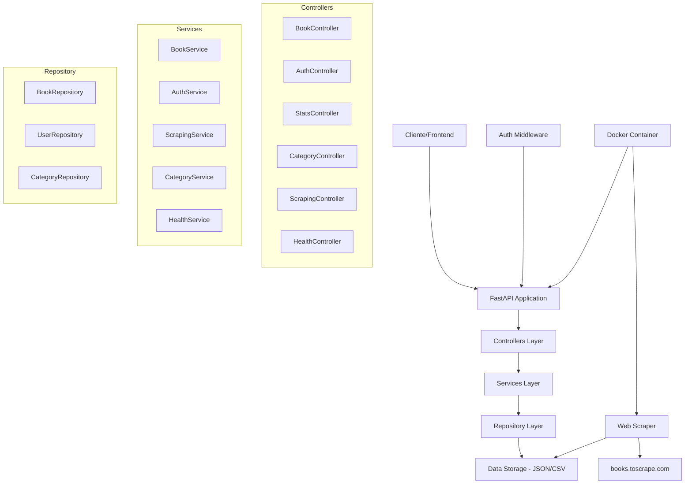
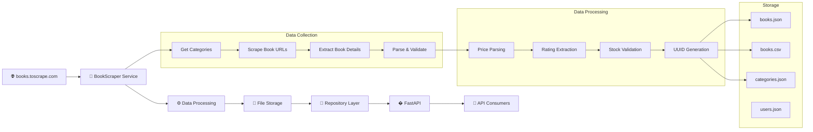
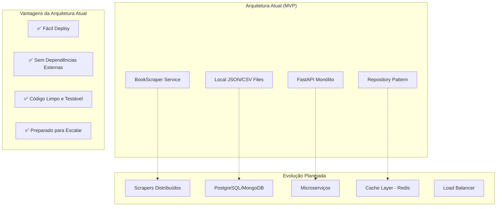

# 📚 Books Scraper API

Uma aplicação completa de web scraping para extrair dados de livros do site **books.toscrape.com**, construída com Python, FastAPI e Docker. O projeto oferece uma API REST robusta para acessar e analisar dados de livros com recursos de autenticação, filtragem avançada e estatísticas detalhadas.

## 🎯 Objetivos do Projeto

- **Web Scraping Automatizado**: Extrair dados completos de livros (título, preço, categoria, avaliação, disponibilidade)
- **API REST Moderna**: Fornecer endpoints bem documentados para acesso aos dados
- **Autenticação JWT**: Sistema seguro de autenticação com tokens de acesso e refresh
- **Análise de Dados**: Estatísticas e insights sobre o catálogo de livros
- **Arquitetura Escalável**: Design modular seguindo boas práticas de desenvolvimento

## 🏗️ Arquitetura do Sistema



### Componentes Principais

1. **API Layer**: FastAPI com documentação automática Swagger
2. **Controllers**: Gerenciam requisições HTTP e respostas
3. **Services**: Lógica de negócio e processamento de dados
4. **Repository**: Camada de acesso aos dados
5. **Models**: Estruturas de dados (Book, User, Category)
6. **Middleware**: Autenticação JWT e validação
7. **Scraper**: Extração automatizada de dados

## 🏛️ Plano Arquitetural

### Pipeline de Ingestão de Dados

O projeto implementa um pipeline simples e eficiente de ingestão de dados do site **books.toscrape.com**:



**Fluxo Detalhado:**
1. **Scraper** acessa books.toscrape.com e coleta categorias
2. **Para cada categoria**, coleta URLs de todos os livros (com paginação)
3. **Para cada livro**, extrai dados detalhados (título, preço, rating, estoque, descrição)
4. **Processa os dados** (parsing de preços, validação, normalização)
5. **Salva em arquivos** JSON e CSV no diretório `/data`
6. **API consome** os mesmos arquivos através da camada Repository
7. **Clientes** acessam os dados via endpoints REST

### Arquitetura Escalável Baseada em Boas Práticas

O código foi desenvolvido seguindo **princípios de design sólidos** que facilitam a evolução futura:

#### 🏗️ **Padrões de Design Implementados:**

**1. Separation of Concerns (Separação de Responsabilidades)**
```
Controllers → Services → Repository → Data Storage
```

**2. Dependency Injection**
```python
# main.py - Injeção de dependências
book_repository = BookRepository(DATA_DIR)
book_service = BookService(book_repository)
book_controller = BookController(book_service)
```

**3. Interface Segregation**
```python
# Repository com interface abstrata
class BookRepositoryInterface(ABC):
    @abstractmethod
    def get_all_books(self) -> List[Book]:
        pass
```

**4. Single Responsibility Principle**
- **Controllers**: Apenas manipulação de requisições HTTP
- **Services**: Lógica de negócio e processamento
- **Repository**: Acesso a dados
- **Models**: Estruturas de dados com validação

**5. Data Transfer Objects (DTOs)**
```python
@dataclass
class Book:
    # Modelo bem estruturado com validação
    @classmethod
    def from_dict(cls, data: Dict[str, Any]) -> 'Book':
        # Conversão e validação de tipos
```

#### 🔄 **Abstração da Camada de Repository**

A camada de Repository foi **abstraída intencionalmente** para facilitar a migração futura:

```python
# Atual: File System
class BookRepository(BookRepositoryInterface):
    def __init__(self, data_dir: Path):
        self.books_file = data_dir / "books.json"
    
    def get_all_books(self) -> List[Book]:
        # Lê do arquivo JSON
        with open(self.books_file, 'r') as f:
            return [Book.from_dict(book) for book in json.load(f)]

# Futuro: Database (exemplo)
class DatabaseBookRepository(BookRepositoryInterface):
    def __init__(self, connection_string: str):
        self.db = create_connection(connection_string)
    
    def get_all_books(self) -> List[Book]:
        # Consulta SQL
        return self.db.query("SELECT * FROM books")
```

#### � **Evolução da Arquitetura**



#### � **Cenários de Uso para Cientistas de Dados**

**1. Acesso Direto aos Dados**
```python
# Via API REST
import requests
books = requests.get("https://pos-tech.borca.dev/v1/books").json()

# Via arquivos (análise local)
import pandas as pd
df = pd.read_csv("data/books.csv")
```

**2. Análises Disponíveis**
- **Estatísticas por categoria**: Distribution de preços, ratings
- **Análise temporal**: Trends de disponibilidade
- **Correlações**: Preço vs Rating vs Categoria
- **Análise de texto**: Descrições e títulos

**3. Endpoints para Data Science**
```bash
GET /api/v1/stats/overview          # Estatísticas gerais
GET /api/v1/stats/categories        # Análise por categoria
GET /api/v1/books?format=csv        # Export para análise
```

#### 🤖 **Potencial de Integração ML**

**Casos de Uso Futuros:**
1. **Classificação de Livros**: Categorização automática baseada em título/descrição
2. **Predição de Preços**: Modelo para estimar preços justos
3. **Sistema de Recomendação**: Baseado em categorias e ratings
4. **Detecção de Anomalias**: Identificar preços ou dados inconsistentes

## 📋 Funcionalidades

### 🔍 Endpoints da API

#### **Livros (`/api/v1/books`)**
- `GET /books` - Lista todos os livros com filtros opcionais
- `GET /books/{book_id}` - Busca livro por ID
- `GET /books/search` - Busca por título ou categoria
- `GET /books/top-rated` - Livros mais bem avaliados
- `GET /books/price-range` - Livros por faixa de preço

#### **Autenticação (`/api/v1/auth`)**
- `POST /auth/login` - Login com username/password
- `POST /auth/refresh` - Renovar token de acesso

#### **Estatísticas (`/api/v1/stats`)**
- `GET /stats/overview` - Estatísticas gerais
- `GET /stats/categories` - Estatísticas por categoria

#### **Categorias (`/api/v1/categories`)**
- `GET /categories` - Lista todas as categorias
- `GET /categories/{category_id}` - Detalhes da categoria

#### **Web Scraping (`/api/v1/scraping`)**
- `POST /scraping/run` - Executar scraping (requer autenticação)

#### **Health Check (`/api/v1/health`)**
- `GET /health` - Status da aplicação

### 🔐 Sistema de Autenticação

- **JWT Tokens**: Access token (15 min) + Refresh token (7 dias)
- **Middleware**: Validação automática de tokens
- **Endpoints Protegidos**: Scraping requer autenticação

### 📊 Filtros e Consultas

- **Por Categoria**: Filtrar livros por categoria específica
- **Por Preço**: Faixa de preço mínimo e máximo
- **Por Avaliação**: Filtrar por rating (1-5 estrelas)
- **Por Disponibilidade**: Livros em estoque ou esgotados
- **Paginação**: Limit e offset para grandes datasets
- **Busca Textual**: Pesquisa por título

## 🚀 Instalação e Configuração

### Pré-requisitos

- **Docker** e **Docker Compose**
- **Python 3.11+** (para desenvolvimento local)
- **Poetry** (para gerenciamento de dependências)

### 1. Clonando o Repositório

```bash
git clone <repository-url>
cd module-1
```

### 2. Configuração com Docker (Recomendado)

```bash
# Construir as imagens
make build

# Executar scraping + API
make dev

# Ou executar separadamente:
make scrape  # Apenas scraping
make api     # Apenas API
```

### 3. Configuração para Desenvolvimento Local

```bash
# Instalar dependências
make install

# Executar scraping local
make local-scrape

# Executar API local
make local-api
```

### 4. Variáveis de Ambiente

Crie um arquivo `.env` na raiz do projeto:

```bash
cp .env.example .env
```


## 📖 Documentação da API

### Swagger UI (Interativo)
- **Produção**: [https://pos-tech.borca.dev/docs](https://pos-tech.borca.dev.com/docs)

### ReDoc (Alternativo)
- **Produção**: [https://pos-tech.borca.dev/redoc](https://pos-tech.borca.dev/redoc)

### Exemplo de Uso

```bash
# 1. Fazer login
curl -X POST "https://pos-tech.borca.dev/api/v1/auth/login" \
  -H "Content-Type: application/json" \
  -d '{"username": "admin", "password": "admin"}'

# 2. Buscar livros
curl "https://pos-tech.borca.dev/api/v1/books?category=Fiction&limit=10"

# 3. Estatísticas
curl "https://pos-tech.borca.dev/api/v1/stats/overview"
```

## 🌐 Links Importantes

### 🔗 API em Produção
- **URL Base**: [https://pos-tech.borca.dev.com](https://pos-tech.borca.dev.com)
- **Swagger Docs**: [https://pos-tech.borca.dev.com/docs](https://pos-tech.borca.dev.com/docs)

### 📺 Vídeo Explicativo
- **Demonstração Completa**: 

## 🗂️ Estrutura de Dados

### Formato dos Livros
```json
{
  "id": "unique-book-id",
  "title": "Book Title",
  "price": 29.99,
  "category": "Fiction",
  "rating": 4,
  "in_stock": true,
  "availability": "In stock (5 available)",
  "image_url": "https://example.com/image.jpg",
  "description": "Book description..."
}
```

### Arquivos de Dados
- **`data/books.json`**: Catálogo completo de livros
- **`data/books.csv`**: Dados em formato CSV para análise
- **`data/categories.json`**: Lista de categorias
- **`data/users.json`**: Usuários do sistema

## 🔧 Desenvolvimento

### Estrutura do Projeto
```
src/module_1/
├── api/                 # FastAPI application
├── controllers/         # HTTP request handlers
├── services/           # Business logic
├── repository/         # Data access layer
├── models/             # Data models
├── middleware/         # Authentication middleware
└── script/             # Scraping scripts
```